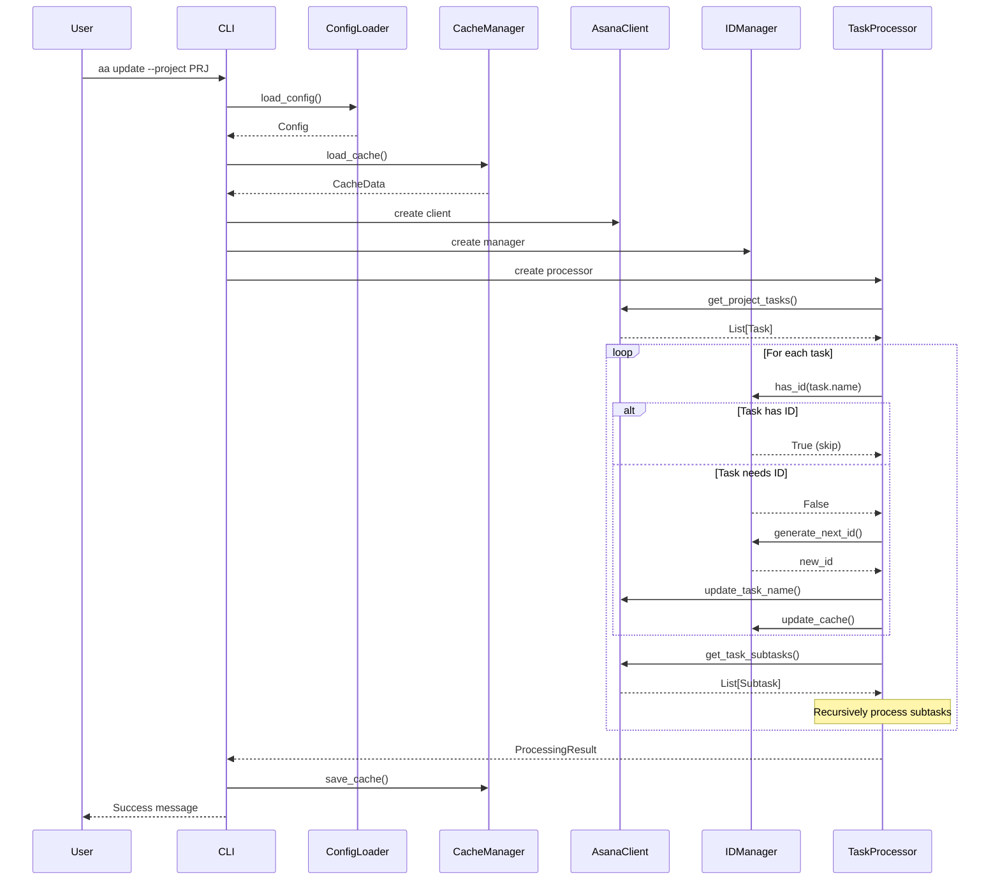
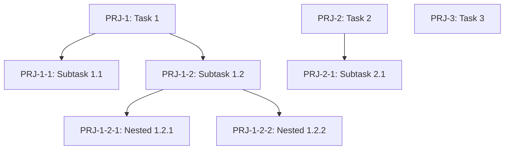

# Документ дизайна

## Обзор

Инструмент `aa` - это асинхронное консольное приложение на Python для автоматического управления человекочитаемыми идентификаторами задач в Asana. Приложение построено на фреймворке Click для CLI, использует httpx для асинхронных HTTP запросов к Asana API, и Pydantic для валидации данных.

Основная идея: добавлять короткие префиксы (например, `PRJ-5`, `PRJ-5-1`) в начало названий задач, что упрощает их идентификацию в обсуждениях и документации.

## Архитектура

### Общая структура

```
aa/
├── __init__.py
├── __main__.py          # Entry point для команды aa
├── cli.py               # Главная группа команд Click
├── commands/
│   ├── __init__.py
│   ├── init.py          # Команда aa init
│   ├── scan.py          # Команда aa scan
│   └── update.py        # Команда aa update
├── core/
│   ├── __init__.py
│   ├── asana_client.py  # Асинхронный клиент для Asana API
│   ├── id_manager.py    # Логика управления ID
│   └── task_processor.py # Обработка задач и подзадач
├── models/
│   ├── __init__.py
│   ├── config.py        # Pydantic модели для конфига
│   ├── cache.py         # Pydantic модели для кэша
│   └── task.py          # Модели задач Asana
└── utils/
    ├── __init__.py
    ├── config_loader.py # Загрузка и валидация конфига
    ├── cache_manager.py # Управление кэшем
    └── logger.py        # Настройка логирования
```

### Слои приложения

1. **CLI Layer** (`cli.py`, `commands/`) - обработка команд пользователя, параметров, флагов
2. **Core Layer** (`core/`) - бизнес-логика работы с ID и задачами
3. **API Layer** (`core/asana_client.py`) - взаимодействие с Asana API
4. **Data Layer** (`models/`, `utils/`) - модели данных, конфигурация, кэш

## Компоненты и интерфейсы

### 1. CLI Commands

#### InitCommand (`commands/init.py`)
```python
@click.command()
@click.option('--config', default='.aa.yml', help='Path to config file')
@click.option('-f', '--force', is_flag=True, help='Create template without interactive setup')
async def init(config: str, force: bool) -> None:
    """Initialize aa configuration file"""
```

По умолчанию работает в интерактивном режиме:
1. Запрашивает Personal Access Token (скрытый ввод)
2. Получает список всех проектов пользователя из Asana
3. Предлагает выбрать проекты (множественный выбор)
4. Запрашивает трехбуквенный код для каждого проекта (валидация: 3 заглавные буквы)
5. Создает готовый конфиг с реальными данными и комментариями со ссылками на проекты

С флагом `-f/--force` создает шаблон конфигурационного файла `.aa.yml` без интерактива.

#### ScanCommand (`commands/scan.py`)
```python
@click.command()
@click.option('--config', default='.aa.yml', help='Path to config file')
@click.option('--project', help='Project code to scan (default: all)')
@click.option('--debug', is_flag=True, help='Enable debug logging')
@click.option('--ignore-conflicts', is_flag=True, help='Ignore ID conflicts')
async def scan(config: str, project: str | None, debug: bool, ignore_conflicts: bool) -> None:
    """Scan projects and update cache"""
```

Анализирует проекты, извлекает существующие ID, обновляет кэш.

#### UpdateCommand (`commands/update.py`)
```python
@click.command()
@click.option('--config', default='.aa.yml', help='Path to config file')
@click.option('--project', help='Project code to update (default: all)')
@click.option('--dry-run', is_flag=True, help='Show changes without applying')
@click.option('--debug', is_flag=True, help='Enable debug logging')
@click.option('--ignore-conflicts', is_flag=True, help='Ignore ID conflicts')
async def update(config: str, project: str | None, dry_run: bool, debug: bool, ignore_conflicts: bool) -> None:
    """Assign IDs to tasks without them"""
```

Присваивает ID задачам, которые их не имеют.

### 2. Asana Client

```python
class AsanaClient:
    """Асинхронный клиент для работы с Asana API"""
    
    def __init__(self, token: str):
        self.token = token
        self.client = httpx.AsyncClient(
            base_url="https://app.asana.com/api/1.0",
            headers={"Authorization": f"Bearer {token}"},
            timeout=30.0
        )
    
    async def get_workspaces(self) -> list[dict]:
        """Получить список workspace пользователя"""
    
    async def get_projects(self, workspace_id: str) -> list[dict]:
        """Получить все активные (не архивные) проекты в workspace"""
    
    async def get_project_tasks(self, project_id: str) -> list[dict]:
        """Получить все задачи проекта, отсортированные по дате создания"""
        
    async def get_task_subtasks(self, task_id: str) -> list[dict]:
        """Получить подзадачи задачи"""
        
    async def update_task_name(self, task_id: str, new_name: str) -> dict:
        """Обновить название задачи"""
        
    async def close(self):
        """Закрыть HTTP клиент"""
```

### 3. ID Manager

```python
class IDManager:
    """Управление логикой присвоения и отслеживания ID"""
    
    def __init__(self, cache: CacheData):
        self.cache = cache
    
    def extract_id(self, task_name: str, project_code: str) -> str | None:
        """Извлечь ID из названия задачи используя regex"""
        # Паттерн: ^{CODE}-\d+(-\d+)*
        
    def has_id(self, task_name: str, project_code: str) -> bool:
        """Проверить наличие ID в названии"""
        
    def generate_next_root_id(self, project_code: str) -> str:
        """Сгенерировать следующий ID для корневой задачи"""
        # Например: PRJ-6
        
    def generate_next_subtask_id(self, parent_id: str, project_code: str) -> str:
        """Сгенерировать следующий ID для подзадачи"""
        # Например: PRJ-5-3
        
    def update_cache_for_id(self, task_id: str, project_code: str):
        """Обновить кэш после присвоения ID"""
        
    def detect_conflicts(self, existing_ids: list[str], project_code: str) -> list[str]:
        """Обнаружить конфликты между кэшем и существующими ID"""
```

### 4. Task Processor

```python
class TaskProcessor:
    """Обработка задач и их иерархии"""
    
    def __init__(self, asana_client: AsanaClient, id_manager: IDManager):
        self.asana = asana_client
        self.id_manager = id_manager
    
    async def process_project(
        self, 
        project_id: str, 
        project_code: str,
        dry_run: bool = False
    ) -> ProcessingResult:
        """Обработать все задачи проекта"""
        
    async def process_task_hierarchy(
        self,
        task: dict,
        project_code: str,
        parent_id: str | None = None,
        dry_run: bool = False
    ) -> list[TaskUpdate]:
        """Рекурсивно обработать задачу и её подзадачи"""
```

## Модели данных

### Config Model

```python
class ProjectConfig(BaseModel):
    code: str = Field(..., min_length=2, max_length=5, pattern="^[A-Z]{2,5}$")
    asana_id: str = Field(..., min_length=1)

class Config(BaseModel):
    asana_token: str = Field(..., min_length=1)
    interactive: bool = Field(default=False)
    projects: list[ProjectConfig] = Field(..., min_items=1)
```

### Cache Model

```python
class ProjectCache(BaseModel):
    last_root: int = Field(default=0, ge=0)
    subtasks: dict[str, int] = Field(default_factory=dict)
    # Ключ в subtasks - это ID родителя без префикса проекта
    # Например: "5" -> 3 означает PRJ-5-3 последняя подзадача

class CacheData(BaseModel):
    projects: dict[str, ProjectCache] = Field(default_factory=dict)
    # Ключ - код проекта (например "PRJ")
```

Пример кэша:
```yaml
projects:
  PRJ:
    last_root: 42
    subtasks:
      "5": 3      # PRJ-5-3
      "12": 7     # PRJ-12-7
      "12-2": 4   # PRJ-12-2-4
  TSK:
    last_root: 15
    subtasks: {}
```

### Task Model

```python
class AsanaTask(BaseModel):
    gid: str
    name: str
    created_at: datetime
    parent: dict | None = None
    
class TaskUpdate(BaseModel):
    task_id: str
    old_name: str
    new_name: str
    assigned_id: str
```

## Correctness Properties

*A property is a characteristic or behavior that should hold true across all valid executions of a system-essentially, a formal statement about what the system should do. Properties serve as the bridge between human-readable specifications and machine-verifiable correctness guarantees.*


### Property 1: ID extraction and formatting consistency
*For any* task name with a valid ID format (CODE-N or CODE-N-M-...), extracting the ID and then formatting it back should preserve the original ID string.
**Validates: Requirements 2.4**

### Property 2: Configuration validation rejects invalid configs
*For any* configuration missing required fields (asana_token, projects), Pydantic validation should raise a validation error.
**Validates: Requirements 2.2**

### Property 3: Task sorting by creation date
*For any* list of tasks returned from Asana API, the tasks should be ordered by their created_at timestamp in ascending order.
**Validates: Requirements 2.3**

### Property 4: Maximum ID detection
*For any* non-empty list of existing IDs, the system should correctly identify the maximum numeric value, and for an empty list should return 0.
**Validates: Requirements 2.5**

### Property 5: Conflict detection triggers error
*For any* situation where an existing ID in Asana is greater than the cached last_root value (without --ignore-conflicts flag), the system should terminate with an error.
**Validates: Requirements 2.6, 9.1**

### Property 6: Cache persistence round-trip
*For any* valid cache data structure, saving to YAML and then loading should produce an equivalent cache object.
**Validates: Requirements 2.7, 3.8, 8.4**

### Property 7: Tasks with existing IDs are skipped
*For any* task that already has an ID in its name matching the project code pattern, the system should not modify that task.
**Validates: Requirements 3.2**

### Property 8: Root task ID format
*For any* root task without an ID, after processing the task name should start with the pattern CODE-N where CODE is the project code and N is a positive integer.
**Validates: Requirements 3.3**

### Property 9: Subtask ID format
*For any* subtask without an ID, after processing the task name should start with the pattern CODE-N-M where the parent task has ID CODE-N.
**Validates: Requirements 3.4**

### Property 10: Nested subtask ID format
*For any* subtask of a subtask without an ID, after processing the task name should start with the pattern CODE-N-M-K where the parent has ID CODE-N-M.
**Validates: Requirements 3.5**

### Property 11: Counter increment on ID assignment
*For any* task that receives a new ID, the corresponding counter in the cache (either last_root or subtasks entry) should be incremented.
**Validates: Requirements 3.7**

### Property 12: Project code consistency
*For any* set of projects being processed, each task should receive an ID with the correct project code matching its project configuration.
**Validates: Requirements 4.3**

### Property 13: Project ID mapping
*For any* project being processed, the system should use the asana_id from the configuration that corresponds to the project code.
**Validates: Requirements 4.4**

### Property 14: Dry-run prevents modifications
*For any* execution with --dry-run flag, no tasks in Asana should be modified and no cache file should be updated.
**Validates: Requirements 5.1, 5.3, 5.4**

### Property 15: Root task counter usage
*For any* root task being processed, the system should use the last_root counter from the cache to determine the next ID.
**Validates: Requirements 8.1**

### Property 16: Subtask counter usage
*For any* subtask being processed, the system should use the parent task's counter from the subtasks section of the cache.
**Validates: Requirements 8.2**

### Property 17: Conflict resolution with ignore flag
*For any* conflict situation where --ignore-conflicts flag is set, the system should update counters to the maximum found values and continue processing.
**Validates: Requirements 9.2**

### Property 18: Duplicate ID detection
*For any* set of tasks where two or more tasks have the same ID, the system should terminate with an error listing the conflicting tasks.
**Validates: Requirements 9.3**

### Property 19: Interactive init creates valid config
*For any* valid Personal Access Token, the interactive init should fetch all active (non-archived) projects from Asana and create a configuration file that passes Pydantic validation with the provided token and all active projects with URL comments.
**Validates: Requirements 1.5.2, 1.5.3, 1.5.4, 1.5.5, 1.5.6**

### Property 20: Project code format validation
*For any* project code in configuration, the system should accept only 2-5 uppercase letters and reject all other formats.
**Validates: Requirements 1.5.7**

## Обработка ошибок

### Типы ошибок

1. **ConfigurationError** - проблемы с конфигурацией
   - Отсутствующий файл конфига
   - Невалидная структура конфига
   - Отсутствующие обязательные поля

2. **CacheError** - проблемы с кэшем
   - Невалидная структура кэша
   - Проблемы чтения/записи файла

3. **AsanaAPIError** - ошибки API
   - Невалидный токен (401)
   - Проект не найден (404)
   - Rate limiting (429)
   - Сетевые ошибки

4. **IDConflictError** - конфликты идентификаторов
   - ID в Asana больше чем в кэше
   - Дублирующиеся ID

5. **ValidationError** - ошибки валидации данных
   - Невалидный формат ID
   - Невалидный код проекта

### Стратегии обработки

- Все ошибки логируются с соответствующим уровнем (ERROR)
- Критические ошибки (конфиг, API auth) приводят к немедленному завершению
- Конфликты ID можно игнорировать через флаг --ignore-conflicts
- Сетевые ошибки включают retry логику (3 попытки с exponential backoff)
- В dry-run режиме ошибки API не критичны

## Стратегия тестирования

### Unit тесты

Будут покрывать:
- Извлечение ID из названий задач (regex)
- Генерация следующего ID
- Валидация конфигурации через Pydantic
- Загрузка и сохранение кэша
- Определение максимального ID
- Обнаружение конфликтов

### Property-based тесты

Используем библиотеку **Hypothesis** для Python.

Каждый property-based тест должен:
- Запускаться минимум 100 итераций
- Быть помечен комментарием с ссылкой на property из design.md
- Использовать smart generators для создания валидных входных данных

Примеры generators:
- `task_names_with_ids()` - генерирует названия задач с валидными ID
- `task_names_without_ids()` - генерирует названия без ID
- `project_codes()` - генерирует трехбуквенные коды
- `cache_structures()` - генерирует валидные структуры кэша
- `task_hierarchies()` - генерирует иерархии задач

### Integration тесты

Будут использовать моки для Asana API:
- Тестирование полного flow: scan -> update
- Проверка работы с реальными структурами данных
- Тестирование обработки ошибок API

### Тестирование асинхронного кода

- Использование `pytest-asyncio` для async тестов
- Моки для httpx.AsyncClient
- Проверка корректной работы concurrent операций

## Детали реализации

### Regex для извлечения ID

```python
import re

ID_PATTERN = r'^([A-Z]{2,5})-(\d+(?:-\d+)*)(?:\s|$)'

def extract_id(task_name: str, project_code: str) -> str | None:
    """
    Извлекает ID из названия задачи.
    
    Примеры:
    - "PRJ-5 My task" -> "PRJ-5"
    - "AB-5-2 Subtask" -> "AB-5-2"
    - "PROJ-5-2-1 Nested" -> "PROJ-5-2-1"
    - "My task" -> None
    """
    match = re.match(ID_PATTERN, task_name)
    if match and match.group(1) == project_code:
        return f"{match.group(1)}-{match.group(2)}"
    return None
```

### Асинхронная обработка задач

```python
async def process_multiple_projects(
    projects: list[ProjectConfig],
    asana_client: AsanaClient,
    id_manager: IDManager,
    dry_run: bool = False
) -> dict[str, ProcessingResult]:
    """
    Обрабатывает несколько проектов параллельно.
    """
    tasks = [
        process_project(project, asana_client, id_manager, dry_run)
        for project in projects
    ]
    results = await asyncio.gather(*tasks, return_exceptions=True)
    return dict(zip([p.code for p in projects], results))
```

### Rate Limiting

Asana API имеет лимиты:
- 1500 запросов в минуту для Personal Access Token
- Используем exponential backoff при получении 429

```python
async def make_request_with_retry(
    client: httpx.AsyncClient,
    method: str,
    url: str,
    max_retries: int = 3,
    **kwargs
) -> dict:
    """
    Выполняет запрос с retry логикой.
    """
    for attempt in range(max_retries):
        try:
            response = await client.request(method, url, **kwargs)
            if response.status_code == 429:
                retry_after = int(response.headers.get('Retry-After', 60))
                await asyncio.sleep(retry_after)
                continue
            response.raise_for_status()
            return response.json()
        except httpx.HTTPError as e:
            if attempt == max_retries - 1:
                raise
            await asyncio.sleep(2 ** attempt)
```

### Конфигурация через pyproject.toml

```toml
[project]
name = "asana-auto-id"
version = "0.1.0"
description = "Automatic human-readable ID assignment for Asana tasks"
requires-python = ">=3.11"
dependencies = [
    "click>=8.1.0",
    "httpx>=0.27.0",
    "pydantic>=2.0.0",
    "pyyaml>=6.0.0",
]

[project.scripts]
aa = "aa.cli:main"

[build-system]
requires = ["hatchling"]
build-backend = "hatchling.build"

[tool.uv]
dev-dependencies = [
    "pytest>=8.0.0",
    "pytest-asyncio>=0.23.0",
    "hypothesis>=6.0.0",
]
```

### Логирование

```python
import logging
from typing import Literal

LogLevel = Literal["DEBUG", "INFO", "WARNING", "ERROR"]

def setup_logging(level: LogLevel = "INFO") -> None:
    """
    Настраивает логирование для приложения.
    """
    logging.basicConfig(
        level=getattr(logging, level),
        format='%(asctime)s - %(name)s - %(levelname)s - %(message)s',
        datefmt='%Y-%m-%d %H:%M:%S'
    )
```

## Диаграммы

### Поток выполнения команды update



### Структура иерархии ID



## Производительность

### Оптимизации

1. **Параллельная обработка проектов** - используем `asyncio.gather()` для одновременной обработки нескольких проектов
2. **Batch запросы** - группируем запросы к API где возможно
3. **Кэширование** - храним локальный кэш для минимизации API запросов
4. **Асинхронный I/O** - все операции с сетью и файлами асинхронные

### Ожидаемая производительность

- Сканирование проекта с 100 задачами: ~5-10 секунд
- Обновление 50 задач: ~15-20 секунд
- Обработка 5 проектов параллельно: ~20-30 секунд

Основное ограничение - rate limits Asana API.
